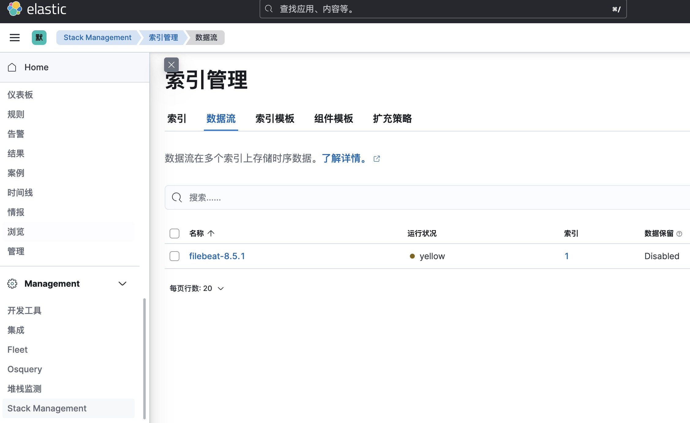
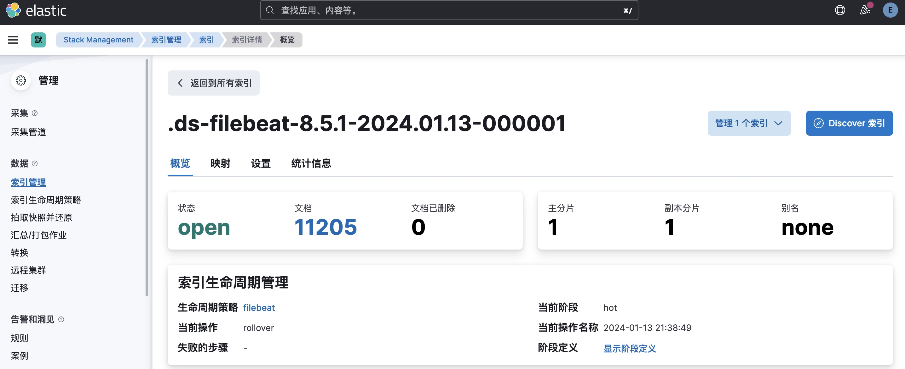
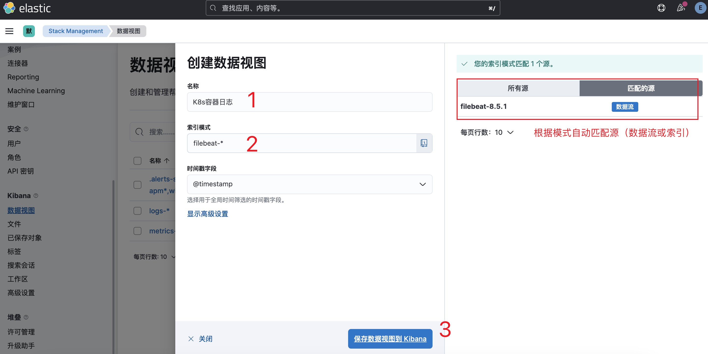
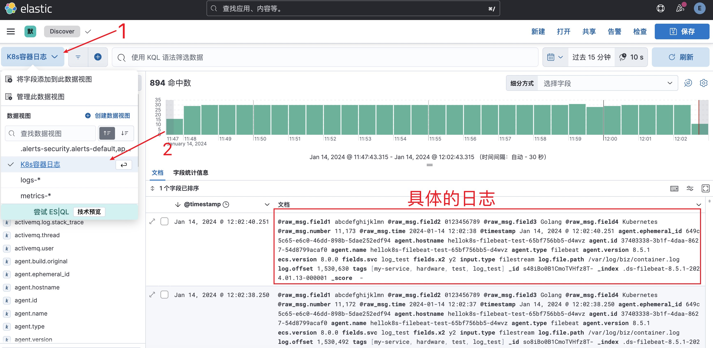
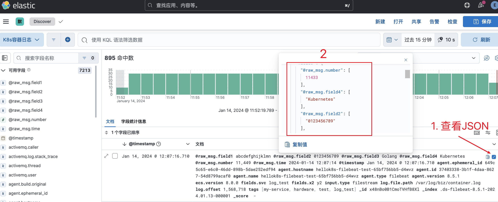
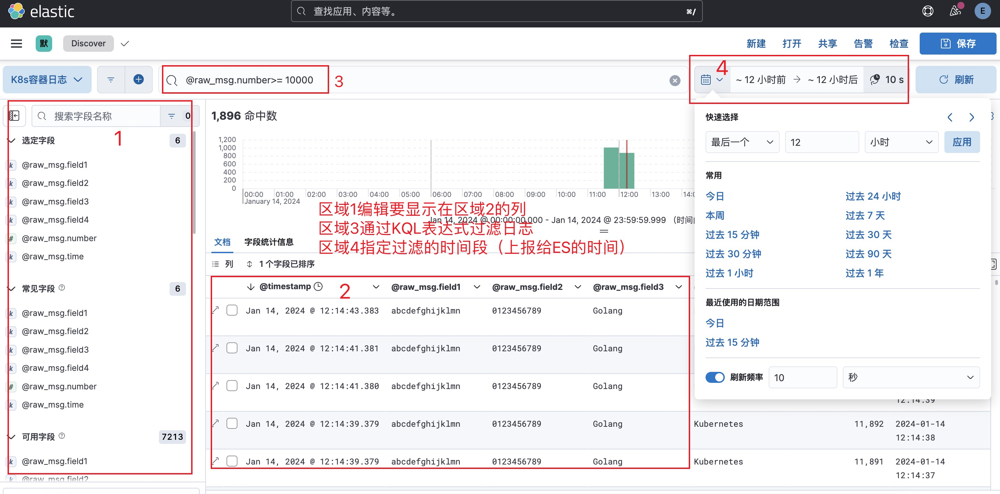

## Kubernetes 日志收集

在Kubernetes（K8s）集群中，日志管理是关键的运维任务之一。由于容器化应用程序的特性，它们产生的日志通常分散在多个Pod中，因此有效地收集和分析这些日志对于故障排除、性能监控和安全审计至关重要。

除了容器应用日志以外，集群组件（控制面Pod、kubelet）也会产生日志，这些日志对于集群的运行和维护同样重要。

### 笔者提醒

部署和维护完整的日志采集和分析组件需要一定的人力和技术成本。除非你已经相当熟悉这些组件或你的团队具备这样运维能力的成员或你是在一个私有环境下运行K8s集群，
否则不建议自行部署维护。笔者推荐直接采用云厂商提供的开箱即用的日志收集&查询产品，可使你有限的团队资源最大化效能。

### 1. 日志分类

在K8s系统中，日志一共分为以下几类：

- 业务容器日志（stdout、stderr）
- K8s组件容器日志（包括apiserver/controller-manager/kube-proxy/scheduler）
- 节点上的kubelet日志（journald）

#### 1.1 业务容器日志

业务容器日志（stdout、stderr）由kubelet收集并**临时存储**到节点上（位于`/var/log/pods`），并且日志文件会随容器的删除而删除。
可使用`kubectl logs`命令查看Pod或容器日志。

> 同时，你还可以在`/var/log/container/`
> 下看到相应的容器日志文件，准确的说，这个目录下的文件只是一个个**符号链接**，它们映射到`/var/log/pods`
> 目录下日志文件。你可以通过`ls -l`命令查看链接目标。

**日志轮转**  
K8s环境中的容器应用日志（stdout&stderr）不会全部存储在节点上，而是通过日志轮转的方式限制单个容器产生的日志文件大小和数量。

日志轮转是K8s集群中一种常见的日志管理方式，通过配置日志文件大小、日志文件最大数量等参数，可以实现日志的自动轮转。

在K8s集群中，节点上的kubelet负责收集当前节点上运行的容器日志和轮转工作。你可以通过在节点上的`/var/lib/kubelet/config.yaml`
文件中添加`containerLogMaxSize`和`containerLogMaxFiles`
两个参数来配置日志轮转，具体配置方式[参考这里](https://kubernetes.io/zh-cn/docs/reference/config-api/kubelet-config.v1beta1/#kubelet-config-k8s-io-v1beta1-KubeletConfiguration)。

> 修改后记得使用`service kubelet restart`使配置生效。

默认情况下，kubelet的日志轮转配置如下：

```
containerLogMaxSize: 10Mi
containerLogMaxFiles: 5
```

笔者将配置分别修改为`4Mi`和`4`
后，通过`watch ls -lh /var/log/pods/default_hellok8s-logtest-fast-64b8597b68-bfw48_7570f83a-2c0b-4414-bc39-2ef7e259a703/hellok8s/`
观察[deployment_logtest_fast.yaml](deployment_logtest_fast.yaml)
中定义的Pod中容器`hellok8s`的日志轮转情况，具体如下：

```shell
Every 5.0s: ls -lh /var/log/pods/default_hellok8s-logtest-fast-64b8597b68-bfw48_7570f83a-2c0b-4414-bc39-2ef7e259a703/hellok8s/                                                                               Fri Dec 15 22:00:41 2023

total 9.6M
-rw-r-----. 1 root root 3.8M Dec 15 22:04 0.log
-rw-r--r--. 1 root root 343K Dec 15 22:02 0.log.20231215-220035.gz
-rw-r--r--. 1 root root 342K Dec 15 22:03 0.log.20231215-220205.gz
-rw-r-----. 1 root root 5.0M Dec 15 22:03 0.log.20231215-220312
```

这里可以看到两点信息：

- 产生的日志文件大小可能略微超过定义的值（受到容器日志的输出速率和kubelet轮转检查频率影响）
- 除了当前容器实例和上一个容器实例的日志文件外，kubelet会压缩之前的日志文件

修改轮转配置**不会影响**旧的（已完成写入或已压缩的）日志文件。

> 在使用集群初期，你可以不用着急搭建日志系统，并且把参数`containerLogMaxSize`调大一点。例如`20M`
> ，搭配默认参数`containerLogMaxFiles: 5`，一个容器就可以（在一个节点上）最多存储100M日志。

#### 1.2 K8s组件容器日志

这里的组件包括apiserver/controller-manager/kube-proxy/scheduler，并且他们都是以Pod形式运行在集群中。所以我们在收集的时候把他们当做普通的业务容器日志来处理。

#### 1.3 节点上的kubelet日志

在使用 systemd 的 Linux 节点上，kubelet 和容器运行时默认写入 journald。 你要使用 journalctl 来阅读 systemd
日志；例如：`journalctl -u kubelet`。如果 systemd 不存在，kubelet 和容器运行时将写入到 /var/log 目录中的 `*.log` 文件。

> journald 是一个系统日志服务，通常与 Linux 操作系统一起使用。它是 Systemd 套件的一部分，负责收集、存储和管理系统日志。
> journald以二进制方式存储管理日志，支持自动轮换和持久化存储，它使用专门的Journal查询语言来过滤日志。

journalctl 常用命令如下：

```shell
# 查看系统日志，pageUp和pageDown按钮进行翻页
# 在日志页面输入 ?pattern 使用正则过滤，比如 ?k8s.* 
journalctl --system

# 查看内核日志
journalctl -k

# 指定时间查找的几种方式
journalctl --since "2023-11-01 00:00:00" --until "2023-11-03 00:00:00"
journalctl --since yesterday
journalctl --since 09:00
journalctl --since 09:00 --until "1 hour ago"

# 查看指定服务单元的日志（默认按时间升序显示，添加-r倒序显示。首行会显示日志的时间范围）
journalctl -u kubelet

# 从尾部跟踪查看
journalctl -u kubelet -f

# -p 按0~7范围内的日志级别查看
journalctl -p 0 -u kubelet

# json格式输出
journalctl -o json
```

### 2. 日志收集方案

K8s官方本身没有提供原生的日志收集解决方案，但推荐了下面几种方案：

- DaemonSet：使用在每个节点上运行的节点级日志记录代理。
- Sidecar：在应用程序的 Pod 中，包含专门记录日志的边车（Sidecar）容器。
- Direct：将日志直接从应用程序中推送到日志记录后端。

这些方案各有优缺点，下面我们分别介绍。

#### 2.1 DaemonSet模式

通过在节点上以DaemonSet方式部署日志代理，然后将节点上所有Pod的stdout&stderr输出（落地到节点的`/var/log/pods`目录）作为日志收集的输入。

- 优点（相对Sidecar模式而言）：
    - 部署和维护成本低（一个节点只部署一个日志代理实例），资源消耗低；
    - 仍然可以使用`kubectl logs`命令查看Pod日志；
- 缺点：
    - 一个日志代理实例收集节点上所有Pod的日志，业务隔离性较差；
    - 节点级的单点故障；

这种方式适用于业务隔离性要求低的集群。

#### 2.2 Sidecar模式

这种方式还可细分为两种部署模式：

- Sidecar容器将应用容器的日志输出到自己的stdout或stderr（少见）；
    - 在少部分场景中：可能在一个容器中输出了不止一条日志流（比如分为2个日志文件）用以区分不同业务日志，这时需要在一个Pod中部署2个Sidecar容器分别跟踪两个日志文件，以便在收集时区分。
    - [pod_two_sidecar_container.yaml](pod_two_sidecar_container.yaml)是来自官方的示例。
- Sidecar容器运行一个日志代理，收集应用容器的日志文件内容（通过`tail`）并传送到日志后端（常见）；
    - 注意此时K8s不会负责应用容器自身写入的日志文件的轮转，需要应用自身负责；
    - 若希望通过`kubectl logs`命令查看Pod日志，可为日志代理配置多一个输出到stdout（不过这样会过多占用节点磁盘空间，因为日志数据正在两次写入磁盘）；
    - **后文将主要介绍这种方式**。

这种方式的利弊如下：

- 优点：每个Pod可以自定义Sidecar容器，灵活性高（但同时每个Pod都要定义Sidecar容器增加了维护工作，也是一种缺点）；
- 缺点：因为每个Pod都要运行Sidecar容器，相比节点级日志代理，资源消耗较高；

虽然占用资源高，但在大型集群中业务种类繁多，通常需要使用这种方式单独收集不同业务容器的日志，以便实现较好的隔离性。

#### 2.3 直接将日志推送到日志后端

这种方式是在应用代码中通过编码的方式将日志直接输出到日志后端。它有几个明显的缺点：

- 业务硬编码日志相关逻辑
- 性能影响：在高负载或频繁产生大量日志的情况下。直接将日志写入后端存储可能导致额外的网络开销和IO操作，影响应用的响应时间。
- 网络延迟和故障： 直接推送日志可能受到网络延迟和故障的影响。如果后端存储不可用，或者网络出现问题，可能导致日志数据的丢失或延迟
- 无法使用`kubelet logs`命令查看日志

综上，这种方式并不常用，不再过多介绍。

### 3. 部署EFK架构

上一节中，我们介绍了3种日志收集方案。在实际项目中，我们通常会将DaemonSet模式和Sidecar模式结合使用。
即DaemonSet代理收集节点上的大部分容器产生的日志，而Sidecar代理收集特定业务容器产生的日志（若没有则不使用）；而更特殊的容器则采用第三种方式。
这样才能以最低资源消耗实现良好的日志收集效果。

不论是K8s官方还是业界，都大力推荐EFK架构来作为日志收集和分析的一条龙技术栈，它由Elasticsearch、Filebeat和Kibana三大开源软件构成。
它们分别用途是：

- Elasticsearch（通常简称ES）：用于存储、索引和搜索大量的结构化和非结构化数据。
- Filebeat：由ES官方维护。用于采集、转换和发送日志数据到Elasticsearch，支持多种数据源。
- Kibana：用于可视化和分析从Elasticsearch中检索到的数据。

前面所说的DaemonSet模式和Sidecar模式，在EFK架构都是指的Filebeat的部署模式。

EFK架构的**工作流程**如下：

- Filebeat 收集日志： Filebeat 在集群中的每个节点上运行（DaemonSet或Sidecar方式），收集来自应用程序、容器和其他服务的日志数据。Filebeat
  具有丰富的插件，可与各种数据源和目标集成。
- Filebeat 过滤和转发： Filebeat 可以对收集到的日志数据进行过滤和转换，然后将其发送到 Elasticsearch 进行持久性存储。这使得日志数据能够在
  Elasticsearch 中被高效地检索和分析（也可以转发到其他目标，如MongoDB, Hadoop，AWS，GCP等）。
- Elasticsearch 存储和索引： Elasticsearch 接收来自 Filebeat 的日志数据，将其索引到分布式的数据存储中。Elasticsearch
  提供灵活的查询语言，支持实时搜索和聚合操作。
- Kibana 可视化和查询： Kibana 提供 Web 界面，允许用户通过直观的界面查询和可视化 Elasticsearch
  中的日志数据。用户可以创建仪表板、图表和报表，以监控系统的状态和性能。

使用EFK架构可以帮助我们快速发现问题、进入故障定位和监控系统状态。ES的横向扩展能力，可以支持大规模集群的日志收集，
而且都是这几个组件都是开源项目，拥有一个活跃的用户社区和丰富的文档资源。

**Filebeat Vs Logstash**  
常用来与EFK比较的是ELK架构，它们的区别在于Filebeat（F）和Logstash（L）。之所以在集群中推荐使用Filebeat，是因为它是一个比Logstash更轻量级的日志收集器，注重简单性和性能。
Logstash是基于 Java 编写的，运行在 JVM 上，这导致它需要更多的资源来运行。Logstash支持更丰富的功能，包括多种输入和输出插件、强大的过滤器和转换功能，这也导致它更高的配置难度以及文档复杂性。

此外，还有其他的日志转发工具可用，例如Fluentd、Fluent-bit、Vector（Rust实现，性能极高）和Promtail，读者可以自行了解。

下面的章节将介绍如何使用Helm来快速安装EFK各软件。

> Helm是K8s生态中一个非常流行的包管理工具，它允许用户通过一个chart包来快速安装和配置K8s集群上的各种应用。
> 如果你是第一次接触Helm，你可以查看 [Helm手记](doc_helm.md) 来快速上手Helm。

> 如果你是第一次接触ElasticSearch，建议你先学习 [ElasticSearch快速上手](doc_es_quickstart.md)
> 来了解ElasticSearch的基本概念和操作。

#### 3.1 使用Helm部署ES

在开始前需要说明一下，由于下一小节要安装的Kibana使用的chart并不支持HTTP连接ES，所以我们部署ES时为TRANSPORT和HTTP都开启SSL。

下面是安装步骤：

```shell
# 添加&更新repo
helm repo add elastic https://helm.elastic.co
helm repo update

# 搜索chart
# - chart中的es版本落后于官方ES版本（截止编写本文档时最新ES版本是8.11.3），但我们可修改chart内的文件
$ helm search repo elastic/elasticsearch               
NAME                 	CHART VERSION	APP VERSION	DESCRIPTION                                  
elastic/elasticsearch	8.5.1        	8.5.1      	Official Elastic helm chart for Elasticsearch

# 下载&解压chart
helm pull elastic/elasticsearch --version=8.5.1 --untar

$ ls elasticsearch
Chart.yaml  examples  Makefile  README.md  templates  values.yaml
```

接下来，需要编辑`values.yaml`以适应我们的需求。[values-deploy.yaml](helm/elasticsearch/values-master.yaml)是本次测试部署时需要修改的参数。

> 你可以在[这个页面](helm/elasticsearch/README.md)找到每个字段的解释以及一些配置指导。

由于是部署单节点集群，所以需要禁用StatefulSet模板中的`discovery.seed_hosts`字段，但直接注释代码不够灵活，
所以笔者在`values.yaml`中增加了`multiNode`变量，变量使用逻辑并不复杂，请读者自行阅读。

部署前检查chart组合`values.yaml`生成的各项K8s对象模板：

```shell
# 语法检查
helm lint ./elasticsearch -f elasticsearch/values-master.yaml
# 内容检查
helm install --dry-run --debug es ./elasticsearch -f elasticsearch/values-master.yaml
```

安装chart：

```shell
# 将es安装在单独的namespace: efk 中，同时设置storageClassName以便在对应的sc中申请存储卷
helm install elasticsearch elasticsearch \
  -f elasticsearch/values-master.yaml \
  -n efk --create-namespace
```

查看部署状态（主要观察Pod是否`Running`状态以及Ready列是否`1/1`）：

```shell
helm status elasticsearch --show-resources -nefk
```

需要注意的是，笔者首次部署时遇到了普通节点内存不足（2g，节点终端响应慢至无法操作）导致elasticsearch无法启动的问题，将节点内存扩容到4g后正常启动。
通过`kubectl top po`看到单个es pod占用了1.5Gi内存。

> `kubectl top`命令需要安装Metrics-Server组件才能正常运行，
> 可参阅[K8s 进阶教程][K8s 进阶教程]。

通过命令查看ES的初始账号`elastic`的访问密码（自动生成或忘记时可能用到）：

```shell
kubectl get secrets --namespace=efk elasticsearch-master-credentials -ojsonpath='{.data.password}' | base64 -d
```

查看ES集群状态：

```shell
# 进入elasticsearch-master-0 shell
kubectl -nefk exec -it elasticsearch-master-0 -- bash

curl -u elastic:123456 -k https://elasticsearch-master.efk.svc.cluster.local:9200/_cluster/health?pretty

# 当集群颜色不是green时使用这个API查看原因
curl -u elastic:123456 -k https://elasticsearch-master.efk.svc.cluster.local:9200/_cluster/allocation/explain?pretty
```

删除部署：

```shell
# un 等价于 del/delete
helm -n efk un elasticsearch
```

#### 3.2 使用Helm部署Kibana

在开始之前需要说明的是，kibana的官方chart模板并不算灵活，它其中的一些配置或代码以硬编码的方式通过ssl连接es，并且其中定义的多个k8s资源（比如configmap、Job等）都是这样的。
这导致我们无法以一种简便的方式关闭ssl（需要修改模板的许多位置）。

> 无法关闭ssl的示例：
> 1. 你可以在模板内搜索关键字`manage-es-token.js`，这段js定义了一些函数用来在es和k8s中创建和删除token/secret（由Job挂载后调用），
     > 其中的代码通过ssl连接es（硬编码）。
> 2. 无法设置`ELASTICSEARCH_SSL_CERTIFICATEAUTHORITIES`为空（helm部署会报错）。

下载并解压chart包：

```shell
helm pull elastic/kibana --version=8.5.1 --untar
```

编辑`values.yaml`，[values-deploy.yaml](helm/kibana/values-deploy.yaml)是本次测试部署时需要修改的参数。

> 你可以在[这个页面](helm/kibana/README.md)找到每个字段的解释。

检查模板：

```yaml
helm lint ./kibana -f kibana/values-deploy.yaml
helm install --dry-run --debug kibana ./kibana -f kibana/values-deploy.yaml
```

安装chart：

```shell
# 安装在单独的namespace: efk 中
helm install kibana ./kibana -n efk -f kibana/values-deploy.yaml
```

查看部署状态（主要观察Pod是否`Running`状态）：

```shell
# 注意记下service对象中5601映射到节点的端口，假设为30080
helm status kibana --show-resources -nefk
```

通过浏览器访问Kibana（部署Kibana的节点地址）：http://kibana_host:30080，输入初始账号`elastic`，密码从上一小节中获取。

删除部署：

```shell
helm -n efk un kibana
```

> 某些时候你可能需要为Kibana安装插件，参考[这个页面][kibana-plugin]。

helm删除kibana部署时如果遇到异常导致部分资源没有清理（再次部署时会有报错提示），可使用下面的指令清理：

```shell
kk -n efk delete cm kibana-kibana-helm-scripts
kk -n efk delete role pre-install-kibana-kibana
kk -n efk delete rolebinding pre-install-kibana-kibana
kk -n efk delete job pre-install-kibana-kibana
kk -n efk delete job post-delete-kibana-kibana
kk -n efk delete sa post-delete-kibana-kibana
kk -n efk delete sa pre-install-kibana-kibana
```

#### 3.3 Filebeat介绍

##### 3.3.1 架构图


##### 3.3.2 组件构成

Filebeat内部主要由以下部件组成：

- Input（输入）
- Harvesters（收集器）
- Registry file（注册表文件）
- Output（输出）

它们协作起来完成日志文件的跟踪、状态保存，以及将事件数据转发到指定的输出。

**harvesters（收集器）**  
每个日志文件都会分配一个单独的收集器。收集器负责逐行读取每个文件，并将内容发送到输出。即使文件被删除或重命名，收集器也会继续读取文件，
直到设置的`close_inactive`时间到达（收集器的最大空闲时间）。

**input（输入）**  
与其他日志收集器类似，输入也是负责设置事件源。Filebeat支持多种输入类型，包括HTTP/TCP/UDP/MQTT/文件流/Kafka/journald等等，请查阅[完整的Input列表](https://www.elastic.co/guide/en/beats/filebeat/8.5/configuration-filebeat-options.html#filebeat-input-types)。
每个输入类型都可以多次指定。

**registry file（注册表文件）**  
Filebeat自身维护一个注册表文件来存储它所收集到的所有新文件的状态（包括文件被转发的状态），并且会经常刷新数据到注册表中。所以如果你的用例涉及每天创建大量新文件，你可能会发现注册表文件变得太大。
参考[这里](https://www.elastic.co/guide/en/beats/filebeat/8.5/reduce-registry-size.html)进行优化。

**output（输出）**  
Filebeat允许将收集到的数据发送到一个指定的输出位置，比如File/Stdout、ES、Logstash、Kafka和Redis等。注意配置中只能指定一个输出位置。

Filebeat可以保证至少一次将数据转发到指定的输出位置。

> 如果Filebeat在转发事件的过程中关闭，它在关闭之前不会等待输出确认所有事件。任何发送到输出但在Filebeat关闭前未确认的事件，
> 都会在Filebeat重新启动时再次发送。这样可以确保每个事件至少发送一次，但最终可能会将重复的事件发送到输出。
> 你可以通过设置`shutdown_timeout`选项将Filebeat配置为在关闭前等待特定的时间。

##### 3.3.3 目录结构

以下布局供参考，具体可能因安装平台而异。

```shell
/usr/share/filebeat   -- home目录
/usr/share/filebeat/bin -- bin文件
/etc/filebeat -- config目录
/var/lib/filebeat -- 数据目录
/var/log/filebeat -- 日志目录
```

Filebeat只是Elastic公司开源的Beats系列软件之一，还有用来采集其他类型数据（如metric、uptime等）的软件，
请参考[Beats系列](https://www.elastic.co/guide/en/beats/filebeat/8.5/filebeat-installation-configuration.html#_whats_next)。

#### 3.4 Filebeat之模块（Modules）

Filebeat 模块是 Filebeat 配置文件的集合，它们提供了一种方便的方式来收集特定类型（如Nginx）的日志。Filebeat 模块可以自动配置
Filebeat，借此简化日志格式的收集、解析和可视化。

参考
[这里](https://www.elastic.co/guide/en/beats/filebeat/8.5/filebeat-installation-configuration.html#collect-log-data)
了解如何使用模块。

你也可以手动配置输入源，不使用模块。本文档的场景是收集Pod日志，所以不使用模块。

#### 3.5 部署Filebeat和业务容器

准备下面两个模板：

- [filebeat-configmap.yaml](efk-arch/filebeat-configmap.yaml)
- [filebeat-sidecar-example.yaml](efk-arch/filebeat-sidecar-example.yaml)

依次部署：

```shell
kk apply -f filebeat-configmap.yaml

# 导出之前安装的es的ca证书，并用它创建secret（filebeat使用https链接es需要用到）
# - 不能直接使用是因为namespace不同
kubectl create secret generic es-cacerts-copy \
  --from-literal=ca.crt="$(kubectl get secret elasticsearch-master-certs -n efk -o jsonpath='{.data.ca\.crt}' | base64 --decode)"

kk apply -f filebeat-sidecar-example.yaml
```

进入filebeat容器内验证ES能否正常连接：

```shell
kubectl exec -it hellok8s-filebeat-test-<POD_ID> -c filebeat -- sh -c 'filebeat test output -e -c /etc/filebeat.yml'
```

此刻，Filebeat应当已经开始发送日志数据到ES，现在我们可以查看Filebeat和ES的日志来进行验证。

查看Filebeat日志：


关键字`Non-zero metrics in the last 30s`表示刚刚采集到了有效指标数据。此外，你还要观察是否出现`level`=`warn`
的日志，如有则说明出现了异常。

查看ES日志：


若打印包含`creating index`的日志，则说明Filebeat成功发送日志到ES。

> 提醒：根据日志观察，Filebeat在运行中会使用100MB~200MB内存空间。

#### 3.6 使用Kibana查看数据

数据就是Filebeat采集到的日志。

需要提前说明的是，ES在v7.9中引入了新的概念——数据流（Data Stream），它本质上是一种组织和管理索引的方式，旨在简化数据流的创建、管理和维护。
数据流非常适用于管理像日志数据这样的时间序列数据，因为它们通常具有相似的结构和模式，且数据一般具有只增不改/删的特点。

> ES中与数据流相关联的特性（名词）有索引模板（Index Templates）、索引生命周期管理（ILM）和隐藏索引（Backing Indices）。
> 如果你想进一步了解数据流的由来，可参考这篇[英文文章][data-stream]。

显然Filebeat也使用数据流的方式来组织和管理发送到ES的索引数据。

按照以下步骤查看和使用Filebeat发送给ES的日志数据。

**1. 查看数据流：左侧菜单->Management->Stack Management->数据流**


**2. 查看隐藏索引：点击数据流列表中的filebeat-8.5.1**


**3. 查看索引详情：点击隐藏索引**

其中的文档数就是Filebeat发送的日志行数。

**4. 创建数据视图-1：左侧菜单->Management->Stack Management->数据视图**


**5. 创建数据视图-2**


**6. 查看数据视图：左侧菜单->Analytics->Discover**


**7. 查看JSON日志**


**8. 数据视图使用**


在数据视图这个页面，我们可以根据JSON字段自由检索日志数据。在确定需要检索的字段后，点击右上角的保存按钮，以便下次直接使用。

其他注意事项：

- 直接删除数据流来丢弃已有的日志数据，Filebeat发送的日志数据会自动创建新的数据流。
    - 不需要手动管理索引（虽然也支持），而是通过ILM来管理。
- 现有的数据流名称`Filebeat-8.5.1`不具有业务标识，实际项目中需要修改Filebeat配置文件来为不同业务创建不同数据流。

#### 3.7 小结

本节以Sidecar模式为例详细介绍了EFK架构的部署使用方式，读者可参考具体配置在自己的环境部署DaemonSet日志代理进行日志采集。
需要注意的是，本文并没有介绍如何采集K8s组件如控制面Pod、kubelet产生的日志。读者可在实际项目中根据情况进行按需采集。

如果有疑问或遇到问题请在本项目issue中留言。

[K8s 进阶教程]:https://github.com/chaseSpace/k8s-tutorial-cn/blob/main/doc_tutorial_senior.md#341-安装metrics-server插件

[kibana-plugin]:https://github.com/elastic/helm-charts/blob/main/kibana/README.md#how-to-install-plugins

[data-stream]: https://datadope.io/en/data-streams-in-elasticsearch-and-logstash/

### 参考

- [Filebeat Docs](https://docs.Filebeat.org/)
- [基于 EFK 的 Kubernetes 日志采集方案](https://xie.infoq.cn/article/fea1fe9dffe70b1d729dc04cb)